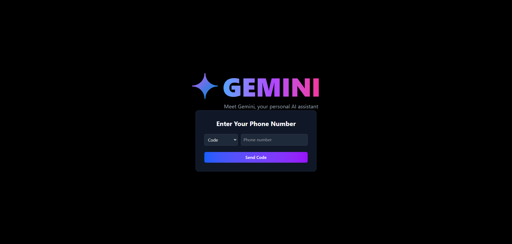

### 📖 Project Overview
The Gemini-style Conversational AI Chat App is a frontend-only web application built with React that mimics the core features of a modern conversational AI platform (like Google Gemini or ChatGPT). The app focuses on delivering a polished user experience with simulated AI interaction, responsive design, and strong UX patterns.

#### Users can:

- Log in using a simulated OTP-based authentication system with dynamic country code selection.

- Manage personal chatrooms — create new ones or delete existing ones with toast confirmations.

- Engage in real-time conversations with a simulated AI assistant that responds with typing indicators, delays, and paginated chat history.

- Share images directly within chats and use intuitive features like dark mode, loading skeletons, keyboard accessibility, and copy-to-clipboard.

#### live link : 

### Setup and Run Instructions
- Follow the steps below to install dependencies, configure the environment, and start the development server for this React + Vite application.

#### ✅ Prerequisites
- Make sure you have the following installed:

1) Node.js (v16 or above) – Download here

2) Installation
- Clone the repository:
step 1 - git clone https://github.com/your-username/your-project-name.git
step 2 - cd your-project-name

3) Install dependencies:
#### npm install

4) Run the Application Locally
 - Start the Vite development server:
#### note npm run dev

This will start the app on http://localhost:5173 by default.

##### 🧪 Project Stack
- Framework: React

- Build Tool: Vite

- Routing: React Router DOM

- Styling: Tailwind CSS

- Form Validation: React Hook Form + Zod

### Folder/component structure explanation 
#### 📸 Preview
Here's a quick look of project structure :

###  How throttling, pagination, infinite scroll, and form validation are implemented ? 

#### How I have implemented form Validation functionality ?
Explaination : These are the steps i have used to implement the form validation using react hook form and zod 
 1) The form dynamically switches between phone input and OTP input using the step state.
 2) When the user clicks "Send Code", the form validates against the phoneSchema.
 3) If valid, the app simulates sending an OTP and moves to the next step.
 4) When the user submits the OTP, it's validated using otpSchema.
 5) If the OTP is correct, the user is logged in and redirected.
 6) In the final step, I also added a protected route. If the user is authenticated, they can access the /dashboard; otherwise, they won't be able to access it directly.

#### How I have implemented Throtlling ?
Explaination : How i have Prevented Gemini from replying too frequently.
1) A constant that introduces a 2-second artificial delay before Gemini sends a response. This simulates a realistic “thinking” or “typing” pause.

2) Defines the minimum time interval (4 seconds) between consecutive Gemini responses. This prevents rapid-fire replies and ensures a more natural pacing in the conversation.

3) A useRef hook (lastAiReplyTime) is used to store the timestamp of Gemini’s last response. This allows the component to persist the time value across renders without causing re-renders.

4) When a user sends a message, the system sets a typing state (setIsTyping(true)) and disables user input. Inside a setTimeout, Gemini's reply is delayed by AI_REPLY_DELAY to enhance the realism of AI interaction.

5) Before generating a reply, the application checks if the time elapsed since lastAiReplyTime exceeds AI_THROTTLE_TIME. If so, it proceeds to respond. After sending the reply, it updates the timestamp to enforce throttling on future messages.

#### How I have implemented infinte scroll ?
Explaination : 
1) Initial Message Load: Loads a fixed number of recent messages when a chat is opened.

2) Scroll Listener: The message list listens for scroll events from the user.

3) Detect Scroll Near Top: When the user scrolls close to the top of the message list, it triggers a function to load more messages.

4) Check Conditions Before Loading:Only loads more if there are older messages available and no current loading in progress.

5) Load Older Messages:Simulates loading older messages by adding older dummy messages before the existing ones.

6) Update Message List:Adds the newly loaded older messages to the current list and updates the visible messages.

7) Update Loading State:Shows a loading indicator while messages are being loaded and hides it afterward.

8) Stop Loading When Done:Stops loading more messages when the maximum number of messages is reached.

9) Maintain Scroll Position:Keeps the scroll position stable to avoid jumps when older messages are added.

10) User Feedback:Displays messages like “Loading older messages...” during loading and “No more messages to load” when all messages are loaded.

#### How I have implemented pagination ?
Explaination :
1) On chat load, only a limited number of messages (MESSAGES_PER_PAGE) are shown initially.

2) The app shows only the last visibleCount messages from the full message list.

3) When scrolling near the top, the handleLoadMore function increases visibleCount by another page of messages (another MESSAGES_PER_PAGE).

4) Instead of loading all messages at once, older messages are appended in chunks/pages when needed.

5) Pagination stops when the maximum allowed messages (MAX_MESSAGES) have been loaded or when there are no more older messages.

### screenShots
Here's a quick look of UI :

#### 📸 landing page Preview

#### 📸 dashboard preview

#### 📸 chatI preview

